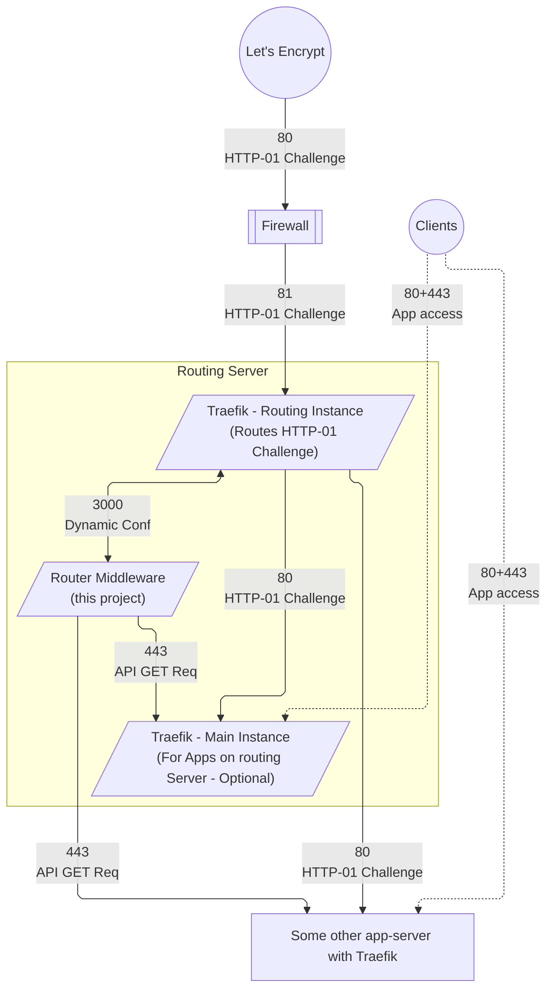

# Traefik HTTP-01 Router

Specifically made for the Docker provider.

## How it works



```bash
bun install
```

To run:

```bash
bun run index.ts
```

This project was created using `bun init` in bun v1.1.29. [Bun](https://bun.sh) is a fast all-in-one JavaScript runtime.
