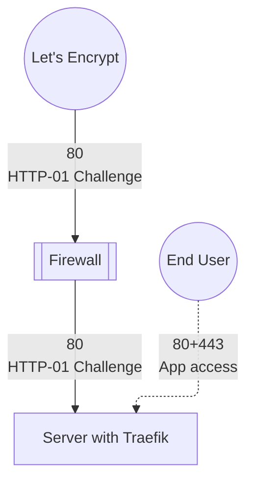
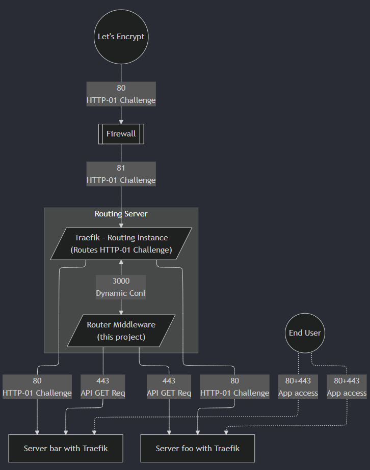

# Traefik HTTP-01 Challenge Router

A tool to manage routes of incoming, Let's Encrypt HTTP-01 Challenge requests for multiple Traefiks behind a NAT(/Firewall).

> [!IMPORTANT]
> - Specifically made for the Docker provider in Traefik.
> - Keep in mind, that [HTTP-01 can't do wildcard certs](https://letsencrypt.org/docs/challenge-types/#http-01-challenge).
> - This projects is not designed to route all traffic trough it. Only http-01 challenges.

- [Traefik HTTP-01 Challenge Router](#traefik-http-01-challenge-router)
  - [Instructions](#instructions)
    - [Prerequisites](#prerequisites)
    - [Default setup](#default-setup)
    - [Additional setup](#additional-setup)
      - [Run apps on same server](#run-apps-on-same-server)
      - [Additional non-Traefik](#additional-non-traefik)
  - [Troubleshooting](#troubleshooting)
  - [How it works](#how-it-works)
    - [The problem](#the-problem)
    - [The Solution](#the-solution)
  - [Why not XYZ-Solution instead?](#why-not-xyz-solution-instead)
  - [Dev setup](#dev-setup)
  - [ToDo](#todo)

## Instructions

### Prerequisites

- Have Docker installed.
- Make sure the Traefik setups on the individual servers have their API exposed `--api.insecure=true` and that the firewall rules are in place to reach it.

> [!NOTE]
> Currently there is no Docker image of this project but it will be provided in the future. For now this repo can be downloaded and compiled to be used.

### Default setup

1. Clone the repo: `git clone https://github.com/tolerantsoftware/Traefik-HTTP-01-Challenge-Router`
2. Adjust the Configuration in `docker-compose.yml`:
   1. Check, if the [Traefik Version](https://hub.docker.com/_/Traefik/tags) is up to date
   2. env vars:
      1. `HTTPS`: Tells the tool, if the the API endpoints are using http or https. If it is https, make sure that `NODE_TLS_REJECT_UNAUTHORIZED` os `0`, as the API Endpoints doesn't have a valid cert at that time.
   3. Traefik
      1. `entrypoints.web.address` is by default `81` so the same Docker instance can also act as an application server. Feel free to change it, and the port in the `ports` section.
      2. Change the FQDN hostnames in `--providers.http.endpoint` so the middleware knows which servers to grab the configuration from. (IP-Addresses are untested and unsure if that would work with the LE validation.)
3. Use `docker compose up -d` to deploy it.

--> Check the Traefik dashboard, if the routes have been applied. `http://adressOfRoutingTraefik:8080/`

### Additional setup

#### Run apps on same server

It is recommended to use a separate Traefik instance for the docker provider. This is due to Traefik not correctly routing http-01 challenge requests, because it prioritizes its own rule, over the one that is provided by the middleware.

#### Additional non-Traefik

If you have this one server, which is not a Traefik, but needs LE certs as well, you can uncomment the dynamic file configuration provider.

## Troubleshooting

Most of the time errors and issues should be logged by the tool and Traefik, but here are some tips.

- Please check the [prerequisites](#prerequisites)
- Make sure that the container can use your DNS
- Check, if the other servers API endpoint is reachable from the server that you want to run this on. `https://adressOfAppplicationTraefik/api/http/routers`

## How it works

### The problem

For HTTP-01 to work, the issuer needs to host a file on port 80 on a path, that Let's Encrypt expects so find. So for example
```url
http://Traefik.server1.example.com/.well-known/acme-challenge/$SOMETOKEN
```



This starts to be a problem, when you want your services only to be reachable internally *and* have multiple Traefik reverse proxies. This introduces the problem that the firewall/router doesn't know which server requested a LE cert and the validation fails.

### The Solution

We simply wrote a little program, which provides an HTTP-configuration for a Traefik router to forward HTTP-01 Challenge requests, nothing special.

The program basically acts as a middleware proxy to compile the configuration into a JSON for the Traefik to use. The Traefik requests this config every5 seconds by default.

> [!NOTE]
> As you might have noticed, the graph below has port 81, that is intentional. We use the same server as one of our applications server. So port 80 had to be free. 



> [!NOTE]
> GitHub doesn't format the graph correctly, so a picture is used. [Graph-code can be found here](flowchart.mmd).

## Why not XYZ-Solution instead?

There are a number of reasons why we opted for HTTP-01 over a different solution. They might be worth a look, before using this project.
- Using a central reverse proxy to do the SSL-stripping and manage certs would a SPOF.
- DNS-01 challenge
  - We wanted to continue to use Traefik as our reverse proxy on each application server for internal services.
  - Using one Traefik instance just for this job would have been too much manual work to provide certs
- Firewall
  - Creating Certs with the Firewall is also a possibility, but there is no way of automating it, as it doesn't provide an official API endpoint to grab the updated certs or automatically request them.
  - We didn't want to route it with the firewall for the same reason: No way of automating it.
- Docker Swarm
  - The hosts are for different departments, which we would like to keep separate.

## Dev setup

> This Project uses [bun](https://bun.sh/).

1. To install dependencies:

```bash
bun install
```

2. To run:

```bash
bun start
```

## ToDo

- [ ] Add automatic Docker Image generation.
